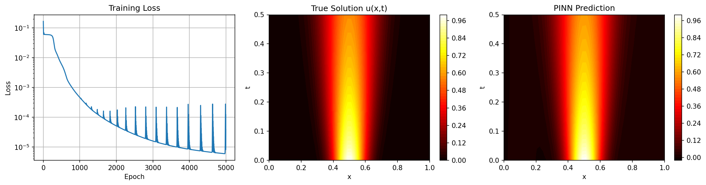

# PhysForge: Automated PDE Discovery

[](https://physforge.onrender.com)
[](https://www.python.org/downloads/)
[](https://pytorch.org/)
[](https://fastapi.tiangolo.com/)

**Full-stack web application** for discovering governing equations from spatiotemporal data using Physics-Informed Neural Networks (PINNs) and sparse regression.

**🔗 Live Demo:** [https://physforge.onrender.com](https://physforge.onrender.com) *(free tier - allow 30s cold start)*



---

## Overview

PhysForge is a compact ML engineering project: PyTorch neural networks with automatic differentiation, a FastAPI backend, background job processing, and a deployed web interface. Upload data, the PINN learns a smooth surrogate for `u(x,t)`, and sparse regression extracts the governing PDE from learned derivatives.

**How it works:**
1. Upload CSV with columns: x (space), t (time), u (field value)
2. PINN fits the field with lightweight smoothness regularization
3. Sparse regression identifies equation terms
4. View discovered equation with quality metrics

---

## Quick Start

### Try the Live Demo
Visit [https://physforge.onrender.com](https://physforge.onrender.com) and upload one of the sample datasets:
- `sample_heat_equation.csv` - Diffusion process
- `sample_burgers_equation.csv` - Nonlinear wave propagation
- `sample_kdv_equation.csv` - Soliton dynamics

### Run Locally
```bash
cd app_simplified
pip install -r requirements.txt
python app.py
```
Visit [http://localhost:8000](http://localhost:8000)

Health check:
```bash
curl http://localhost:8000/health
```

---

## Technical Details

### Physics-Informed Neural Networks (PINNs)
PyTorch implementation using automatic differentiation to compute derivatives for discovery:
```python
# Compute derivatives via autograd
u_t = torch.autograd.grad(u, t, grad_outputs=torch.ones_like(u), create_graph=True)[0]
u_x = torch.autograd.grad(u, x, grad_outputs=torch.ones_like(u), create_graph=True)[0]
u_xx = torch.autograd.grad(u_x, x, grad_outputs=torch.ones_like(u_x), create_graph=True)[0]

# Smoothness regularization keeps the learned surrogate differentiable
smoothness_loss = 0.001 * torch.mean(u_xx**2) + 0.001 * torch.mean(u_t**2)
```

- 3-layer MLP learns field u(x,t) from spatiotemporal data
- Smoothness regularization stabilizes derivative estimates
- Data loss ensures fidelity to observations

### Equation Discovery
Sparse regression identifies minimal equation from computed derivatives:
1. Extract derivatives from trained PINN (u, u_x, u_xx, u_xxx, ...)
2. Build candidate term library (u, u·u_x, u_xx, etc.)
3. Thresholded least-squares finds sparse coefficients
4. Quality metrics: R², sparsity, residual norm

### Validated Examples
- **Heat equation:** u_t = 0.01·u_xx
- **Burgers equation:** u_t = 0.01·u_xx - u·u_x
- **KdV equation:** u_t = -u·u_x - 0.01·u_xxx

---

## Use Cases

- **Research:** Discover PDEs from simulation/experimental data
- **Education:** Interactive demonstration of physics-informed ML
- **Validation:** Test theoretical models against measurements

---

## What This Project Demonstrates

✅ **ML Engineering:** PyTorch model training with custom loss functions  
✅ **Full-Stack Development:** FastAPI backend with background job processing  
✅ **Scientific Computing:** Numerical methods, sparse regression, autograd  
✅ **DevOps:** Docker containerization, cloud deployment  
✅ **Clean Code:** ~600 lines doing real ML, not scaffolding

---

## Performance

- Training: depends on hardware and dataset size; sample datasets usually complete in a few minutes locally
- Equation discovery: <5 seconds
- Dataset size: Tested up to 10,000 spatiotemporal points
- Hardware: CPU-optimized (Render free tier)

---

## Related Projects

**PhysForge Research Edition:** Enhanced version with multiple discovery algorithms (SINDy, PySR), uncertainty quantification, and comprehensive benchmarking. Available at [PhysForge_Research](../PhysForge_Research/)

---

## Technical Stack

| Layer | Technology |
|-------|------------|
| **ML Framework** | PyTorch 2.0+ (autograd, neural networks) |
| **Backend** | FastAPI (background tasks and REST API) |
| **Scientific** | NumPy, Pandas, Matplotlib; SciPy for sample data generation |
| **Frontend** | Vanilla JS, HTML5, CSS (no framework bloat) |
| **Database** | SQLite (job tracking) |
| **Deployment** | Docker, Render (free tier) |

**Architecture:** Single-app deployment optimized for portfolio demonstration. ~600 lines of Python handling ML training, API endpoints, job management, and equation discovery.

---

## Contributing

Issues and suggestions welcome. This is a portfolio/research project demonstrating PINN-based equation discovery.

---

## License

MIT License - See LICENSE file

---

## Contact

**Adam Frank Bentley**
- Email: [adam.f.bentley@gmail.com](mailto:adam.f.bentley@gmail.com)
- GitHub: [@adamfbentley](https://github.com/adamfbentley)
- Live Demo: [https://physforge.onrender.com](https://physforge.onrender.com)

---

## Acknowledgments

- Raissi et al. (2019) - Physics-Informed Neural Networks
- PyTorch team for automatic differentiation
- SciPy community for numerical integration utilities
